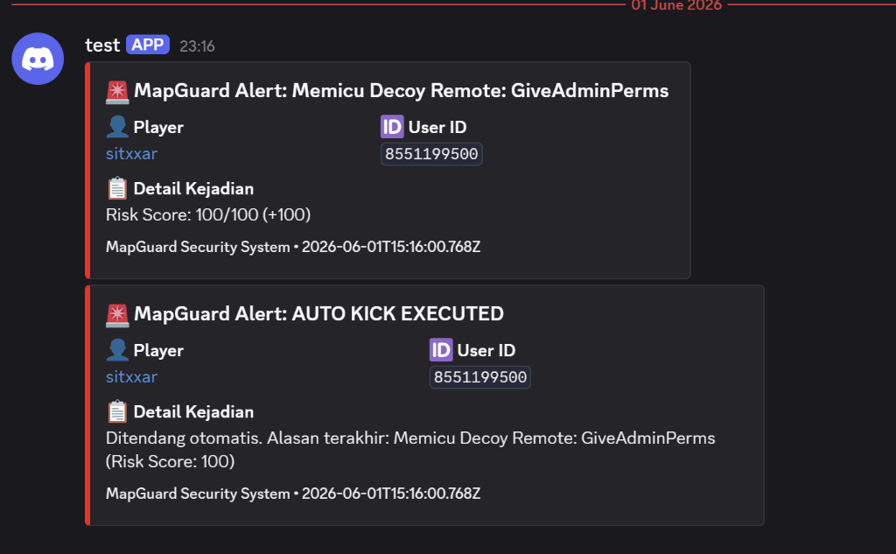
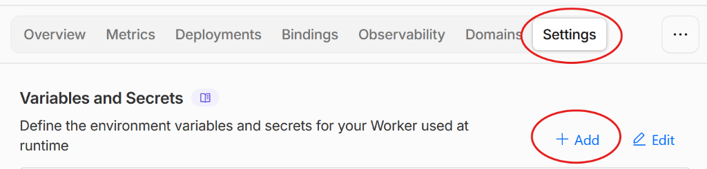
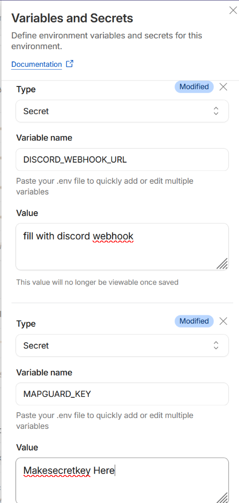
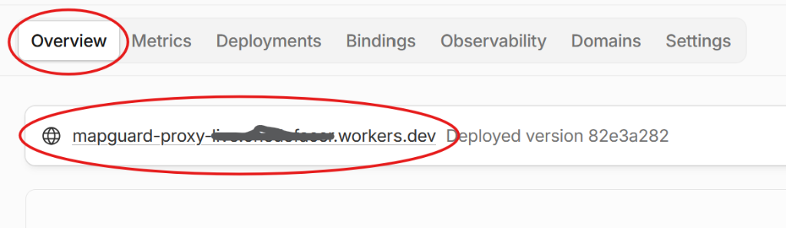

# MapGuard Webhook Proxy

Middleware proxy untuk game Roblox yang menerima log batch keamanan dan meneruskannya ke webhook Discord secara aman tanpa terkena rate limit.

## 📺 Demo Alert Discord

Berikut adalah contoh visual alert yang dikirimkan oleh MapGuard ke channel Discord Anda secara terintegrasi (batch & de-duplikasi otomatis):

## 🚀 1-Click Deploy to Cloudflare Workers

Klik tombol di bawah ini untuk men-deploy proxy ini langsung ke akun Cloudflare Anda secara gratis:

---

## ⚙️ Konfigurasi Environment Variables

Setelah deploy berhasil, ikuti langkah visual di bawah ini untuk memasukkan konfigurasi:

1. Buka dashboard Cloudflare Worker Anda, pilih worker Anda, lalu klik tab **Settings** di kanan atas dan klik tombol **+ Add** pada bagian Variables:
   

2. Masukkan dua variabel berikut (pilih tipe **Secret**):
   * **`DISCORD_WEBHOOK_URL`**
     * **Deskripsi:** URL Webhook Discord saluran tujuan Anda.
   * **`MAPGUARD_KEY`**
     * **Deskripsi:** API Key rahasia pilihan Anda untuk otentikasi request dari modul server Roblox.

   

3. Setelah menyimpan variabel, kembali ke tab **Overview** di menu atas dan salin URL Worker Anda:
   

Klik **Save and Deploy** setelah menambahkan kedua variabel tersebut. Salin URL Worker Anda (misal: `https://mapguard-proxy.username.workers.dev/v1/alerts` dari tab Overview) dan masukkan ke dalam konfigurasi modul Roblox `Config.lua`.
